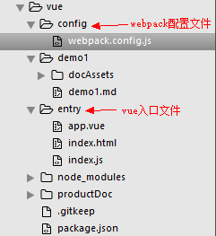
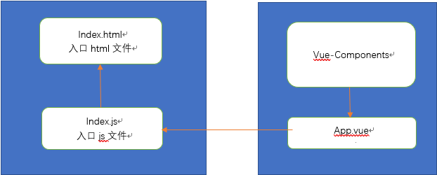

### demo1

使用webpack + vue搭建 hello vue项目。
***
本次实验是采用webpack技术搭建一个简单的vue开发环境。<br />
首先，我们先熟悉一下本次实验的项目结构，项目结构如下图：<br />


既然是webpack为基础，自然免不了进行webpack开发的配置，为了让webpack能够支持vue，必须安装vue-loader，而vue-template-compiler库则支持vue的template语法。所以，在package.json中，应有如下库：
``` 
    "vue": "^2.5.2",
    "vue-loader": "^13.3.0",
    "vue-template-compiler": "^2.5.2",
```
而在``` config/webpack.config.js ```文件中，核心配置项其实很简单。
```
module: {
    rules: [
      {
      	test: /\.vue$/,
      	loader: 'vue-loader'
      }
    ]
  },
```
***
下一步，我们则进行vue的简单demo开发，首先我们得知晓在entry目录下三个文件的含义。<br />
 <br />


